# Diagrama de Classes

Abaixo está o diagrama das principais entidades do nosso domínio e como os padrões interagem. (Recomenda-se abrir em um visualizador compatível com Markdown Mermaid, como o próprio GitHub).

```mermaid
classDiagram
    %% Core System
    class GerenciadorDeReservas {
        - static instance: GerenciadorDeReservas
        - reservas: List~Reserva~
        - salas: List~Sala~
        - politicaReserva: PoliticaReserva
        - observers: List~Observer~
        - GerenciadorDeReservas()
        + static getInstance() GerenciadorDeReservas
        + setPoliticaReserva(politica: PoliticaReserva)
        + criarReserva(sala, inicio, fim, dono)
        + alterarReserva(salaAtual, inicioAtual, ...)
        + cancelarReserva(sala, inicio, fim)
        + buscarConflito(sala, inicio, fim) Reserva
        + gerarRelatorioDiario()
    }

    class Reserva {
        + sala: Sala
        + dataInicio: LocalDateTime
        + dataFim: LocalDateTime
        + dono: Usuario
    }

    class Relatorio {
        - static instance: Relatorio
        - contador: int
        - Relatorio()
        + static getInstance() Relatorio
        + gerarRelatorio(titulo: String, conteudo: String)
    }

    %% Strategy Pattern
    class PoliticaReserva {
        <<interface>>
        + verificarPermissao(solicitante: Usuario, donoAtual: Usuario) boolean
    }
    class PoliticaPrioridade {
        + verificarPermissao(solicitante: Usuario, donoAtual: Usuario) boolean
    }
    class PoliticaPrimeiroChegado {
        + verificarPermissao(solicitante: Usuario, donoAtual: Usuario) boolean
    }
    PoliticaReserva <|.. PoliticaPrioridade
    PoliticaReserva <|.. PoliticaPrimeiroChegado

    %% Factory Pattern
    class Sala {
        <<interface>>
        + exibirDetalhes()
        + getNome() String
    }
    class SalaEstudoIndividual {
        - nome: String
    }
    class SalaTrabalhoEmGrupo {
        - nome: String
    }
    class SalaLaboratorio {
        - nome: String
    }
    class FabricaDeSalas {
        + static createSala(tipo: String, nome: String) Sala
    }
    Sala <|.. SalaEstudoIndividual
    Sala <|.. SalaTrabalhoEmGrupo
    Sala <|.. SalaLaboratorio
    FabricaDeSalas ..> Sala : cria

    %% Observer Pattern
    class Observer {
        <<interface>>
        + update(s: Subject)
        + update(mensagem: String, envolvido: Usuario)
    }
    class Notificador {
        + update(s: Subject)
        + update(mensagem: String, envolvido: Usuario)
    }
    Observer <|.. Notificador

    class Subject {
        - observers: List~Observer~
        + registerObserver(o: Observer)
        + removeObserver(o: Observer)
        + notifyObservers()
        + notifyObserversPush(msg: String, user: Usuario)
    }

    class CriacaoReserva
    class AlteracaoReserva
    class CancelamentoReserva

    Subject <|-- CriacaoReserva
    Subject <|-- AlteracaoReserva
    Subject <|-- CancelamentoReserva

    %% Relationships
    GerenciadorDeReservas "1" *-- "many" Reserva
    GerenciadorDeReservas "1" *-- "many" Sala
    GerenciadorDeReservas "1" o-- "1" PoliticaReserva
    GerenciadorDeReservas "1" o-- "many" Observer
    GerenciadorDeReservas ..> Relatorio : usa

    %% Decorator Pattern (Bônus)
    class ReservaBase {
        <<interface>>
        + exibirDetalhes()
    }
    class ReservaDecorator {
        <<abstract>>
        # reserva: ReservaBase
        + exibirDetalhes()
    }
    class ReservaComMultimidia {
        + exibirDetalhes()
    }
    class ReservaComLimpeza {
        + exibirDetalhes()
    }
    ReservaBase <|.. Reserva
    ReservaBase <|.. ReservaDecorator
    ReservaDecorator <|-- ReservaComMultimidia
    ReservaDecorator <|-- ReservaComLimpeza
    ReservaDecorator o-- ReservaBase : decora
```

## Relacionamento dos Componentes
- O **GerenciadorDeReservas** centraliza as ações e possui referências injetadas de **PoliticaReserva** (Strategy) e **Observer** (Notificações).
- Toda criação/alteração/cancelamento de uma **Reserva** instanciará objetos que herdam de **Subject** e disparará avisos para as classes do pacote de Notificações.
- A **FabricaDeSalas** centraliza a criação dos três tipos de sala (`SalaEstudoIndividual`, `SalaTrabalhoEmGrupo`, `SalaLaboratorio`), desacoplando o cliente das classes concretas.
- O padrão **Strategy** possui duas implementações intercambiáveis em tempo de execução: `PoliticaPrimeiroChegado` (FCFS) e `PoliticaPrioridade` (docente > aluno).
- O **Relatorio** (Singleton) é acionado pelo `GerenciadorDeReservas` ao final do dia para persistir as reservas confirmadas em arquivo.
- O padrão **Decorator** *(bônus)* usa a interface `ReservaBase` como contrato comum entre `Reserva` e os decorators. `ReservaDecorator` delega para o objeto interno, enquanto `ReservaComMultimidia` e `ReservaComLimpeza` adicionam comportamento extra sem alterar o `GerenciadorDeReservas`.

